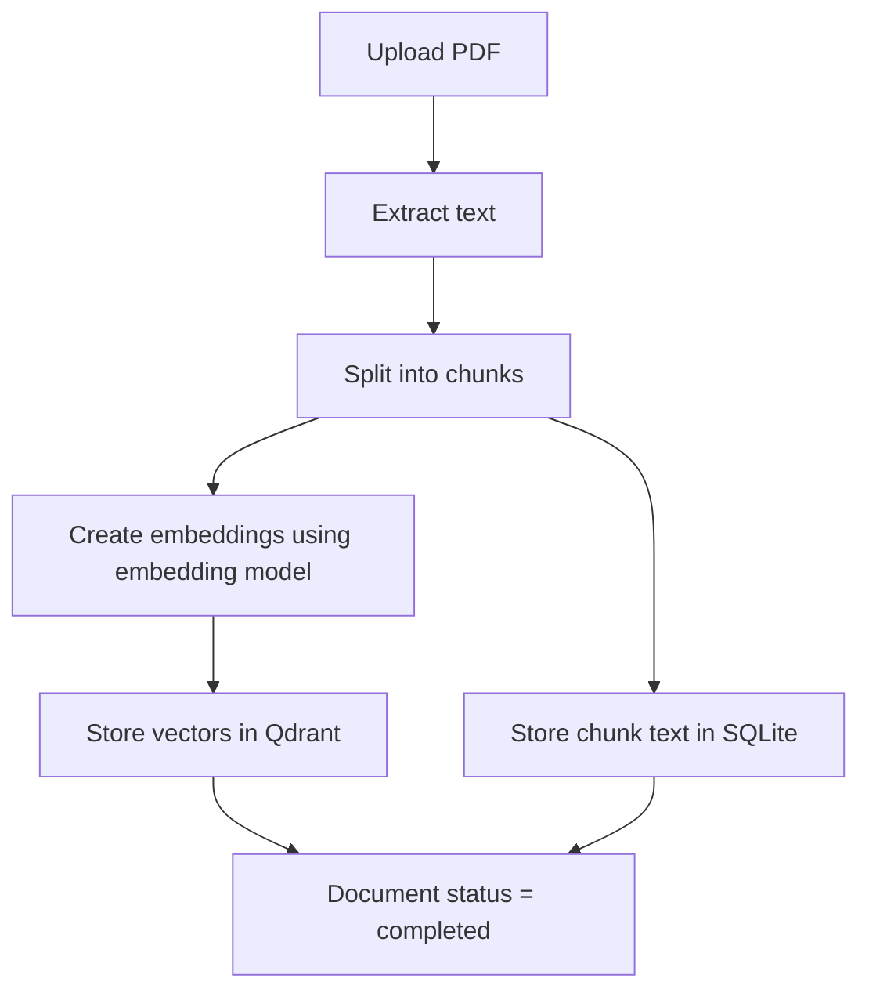
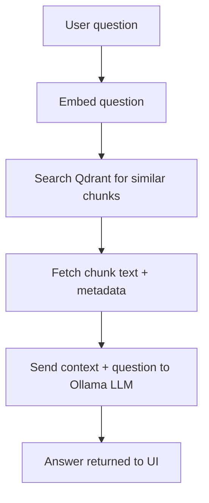
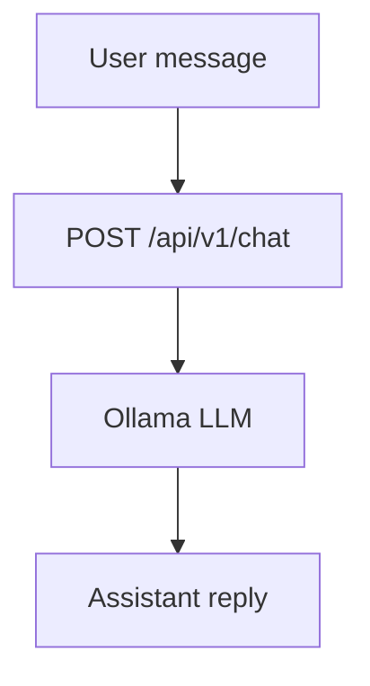

# Unified Multi-Modal Platform (AI Studio)

This project is a simple **AI Studio**:

- **General Chat**: talk to the model like a normal chatbot.
- **RAG Chat**: upload a PDF, process it, then ask questions **about that document**.

Image / Voice tools are **under development**.

---
## Run the project (step-by-step)

### Option A) Run everything with Docker (recommended)

This runs:

- frontend
- backend
- qdrant
- redis
- nginx reverse proxy

Start:

```bash
docker compose up --build
```

Open:

- `http://localhost` (via nginx)

#### View logs (without terminal)

Use **Docker Desktop**:

- Open **Containers**
- Click your compose stack
- Click `backend` (or `frontend` / `nginx`)
- Open the **Logs** tab

#### View logs (optional terminal)

```bash
docker compose logs -f backend
docker compose logs -f frontend
```

### Clone this repository

```bash
git clone https://github.com/Shantnu4755/Unified-Multi-Modal-Platform.git
cd Unified-Multi-Modal-Platform
```

### 1) What you need installed

- **Python 3.10+**
- **Node.js 18+**
- **Ollama** (runs your AI model locally)
- A **Qdrant Cloud** cluster (vector database)

### 2) Install + start Ollama

Install Ollama:

- macOS: download from `https://ollama.com/download`

Start Ollama:

Make sure Ollama is running:

```bash
ollama serve
```

Pull the models (once):

```bash
ollama pull llama3.2:1b
ollama pull nomic-embed-text:latest
```

### 3) Create a Qdrant Cloud cluster

1. Sign up / login to Qdrant Cloud
2. Create a cluster
3. Copy:
   - **Cluster URL** (host)
   - **API key**

You will use these in backend env variables.

### 4) Configure the backend

Backend lives in `backend/`.

You need to set your environment variables (Qdrant URL + API key, etc.).
Look for the backend config / env usage and set values appropriately.

Typical values you need (names may differ by project config):

- Qdrant URL (example): `https://YOUR-CLUSTER.aws.cloud.qdrant.io:6333`
- Qdrant API key: `YOUR_QDRANT_API_KEY`
- Ollama base URL: `http://localhost:11434`
- Chat model: `llama3.2:1b`
- Embeddings model: `nomic-embed-text:latest`

### 5) Run the backend

```bash
cd backend
python -m venv .venv
source .venv/bin/activate
pip install -r requirements.txt
uvicorn app.main:app --host 0.0.0.0 --port 8000 --reload
```

Open API docs:

- `http://localhost:8000/docs`

### 6) Run the frontend

```bash
cd frontend
npm install
npm start
```

Open:

- `http://localhost:3000`

---

## How to use (very simple)

### General Chat (popup)

1. Click the **chat bubble** in the bottom-right.
2. Type a message.
3. You get a reply.

This calls:

- `POST /api/v1/chat`

### RAG (chat with a PDF)

1. Go to **RAG Assistant** tool.
2. **Upload** a PDF.
3. Select it in **Select Document**.
4. Click **Process**.
5. When it says ready, ask questions.

This calls:

- Upload + processing endpoints (document ingestion)
- `POST /api/v1/query` for Q&A

RAG chat history is saved **per document** in your browser (localStorage).

---

## How RAG works

RAG (Retrieval-Augmented Generation) answers questions by grounding the model on your uploaded documents.

At a high level:

- The document is split into chunks.
- Each chunk is converted into an embedding vector.
- Embeddings are stored in Qdrant for similarity search.
- When you ask a question, the question is embedded and used to retrieve the most relevant chunks.
- The retrieved chunks are sent as context to the LLM to generate a final answer.

---

## Flow diagrams

### A) Ingestion flow (upload + process)



### B) Retrieval flow (ask question)



### C) General Chat flow



---

## How to inspect what is stored (Qdrant + SQLite)

### 1) Qdrant Cloud UI (Option 1)

1. Login to **Qdrant Cloud**
2. Open your cluster
3. Go to:
   - **Collections**
   - Select the collection (example: `documents_768`)
4. View points and payload

### 2) Qdrant REST API (Option 2)

Replace:

- `YOUR_QDRANT_API_KEY`
- `YOUR-CLUSTER.aws.cloud.qdrant.io`

```bash
# Collection info (vector size, count, etc.)
curl -H "api-key: YOUR_QDRANT_API_KEY" \
  "https://YOUR-CLUSTER.aws.cloud.qdrant.io:6333/collections/documents_768"

# Scroll points (view payload + ids)
curl -H "api-key: YOUR_QDRANT_API_KEY" \
  -X POST "https://YOUR-CLUSTER.aws.cloud.qdrant.io:6333/collections/documents_768/points/scroll" \
  -H "Content-Type: application/json" \
  -d '{"limit": 5, "with_payload": true, "with_vector": false}'

# Also view vectors (large)
curl -H "api-key: YOUR_QDRANT_API_KEY" \
  -X POST "https://YOUR-CLUSTER.aws.cloud.qdrant.io:6333/collections/documents_768/points/scroll" \
  -H "Content-Type: application/json" \
  -d '{"limit": 2, "with_payload": true, "with_vector": true}'
```

### 3) SQLite (documents + chunks)

The backend stores:

- `documents` table: file metadata + processing status
- `document_chunks` table: chunk text + `document_id` + chunk index

---

## Challenges & Fixes (real problems we hit)

### 1) Qdrant vector dimension mismatch (384 vs 768)

**What happened (simple):**

- Embeddings are just long lists of numbers.
- Qdrant collections are created with a fixed vector size.

When we switched embedding models to `nomic-embed-text:latest`, the embedding size became **768**.
But an older Qdrant collection was created for **384**.
So Qdrant rejected inserts / searches with errors like “expected 384, got 768”.

**How we solved it:**

- The backend now uses **dimension-based collection names** like:
  - `documents_768`
- When the embedding dimension changes, the backend automatically uses the correct collection.

This prevents silent failures and makes upgrades safer.

---

## Notes

- Image + Voice features are **under development**.
- If RAG answers are empty, make sure:
  - The document is processed (`completed`)
  - Qdrant collection matches embedding dimension (example: `documents_768`)# Unified-Multi-Modal-Platform
